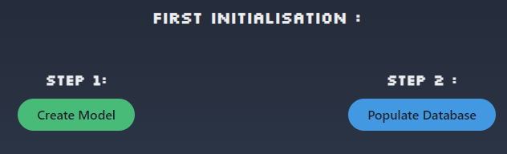
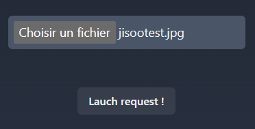

# Goyoogle Images

- [Goyoogle Images](#goyoogle-images)
  - [🧾 Context](#-context)
  - [📚 Stack](#-stack)
  - [:airplane:First Launch](#airplanefirst-launch)
  - [🧞 Commands](#-commands)
  - [🔧 Customisation :](#-customisation-)
  - [☠️ Reseting database](#️-reseting-database)
  - [⚠️ Disclaimer](#️-disclaimer)
## 🧾 Context

Fun little project in order to understand how vectorial database. The idea of developping such a tool came to me when i saw a video of [Fireship](https://www.youtube.com/@beyondfireship) :

[](https://www.youtube.com/watch?v=mBcBoGhFndY)

## 📚 Stack

- 🚀[NextJs](https://nextjs.org/) - Used by some of the world's largest companies, Next.js enables you to create full-stack Web applications by extending the latest React features, and integrating powerful Rust-based JavaScript tooling for the fastest builds.
- 👽[Weaviate](https://weaviate.io/) - Weaviate is an open-source vector database.
It allows you to store data objects and vector embeddings from your favorite ML-models,
and scale seamlessly into billions of data objects.
- ⌨[Chakra ui](https://chakra-ui.com/) - Chakra UI is a simple, modular and accessible component library that gives you the building blocks you need to build your React applications.
- 🐋[Docker](https://www.docker.com/) - Docker is a software platform that allows you to build, test, and deploy applications quickly. Docker packages software into standardized units called containers that have everything the software needs to run including libraries, system tools, code, and runtime.


## :airplane:First Launch

By default and because it is easier later on. The folder that will host all your images is `public/img`.

1 - Copy all your images in this folder.


## 🧞 Commands

All commands are run from the root of the project, from a terminal:

| Command                | Action                                           |
| :--------------------- | :----------------------------------------------- |
| `docker-compose up -d` | Launch docker, slow for first time because arround 8 Go                                    |
| `npm install`          | Installs dependencies                            |
| `npm run dev`          | Starts local dev server at `localhost:3000`      |
| `docker-compose down`          | shut down database & also empties it                            |


Once you launch for the first time, you will need to :

- Create the schema
- Populate the database

To do so just click on the button available on the screen :


Then you can proceed to use the application :



And Finally visualize the most corresponding image !


## 🔧 Customisation :

As stated on the main page, the application copy every new file into the folder and add it to the database. If you'd like to not have your database changed, you can modify the flag in the file 

```typescript
//src/api/compare ~L15
...
const should_save = true
...
```

## ☠️ Reseting database

The project does not have volumes. Meaning that each time you will `docker-compose down` it will destroy your data. Meaning that eveytime you will `docker-compose up -d` you will have to create the schema and populate the database.(as explained before)


## ⚠️ Disclaimer

This project is nowhere near ready for production. It's just a local tool made for fun. Fell free to add any upgrade on your side.
